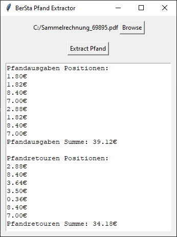

# BerSta Pfand Extractor

## Windows Download

TODO

## What is this?

_BerSta Pfand Extractor_ is a small application intended to help
users of [Foodsoft](https://github.com/foodcoops/foodsoft) with
the import of invoices from [Naturkost Grosshandel BerSta](https://www.bersta.at/).

When importing an invoice into Foodsoft, the billed deposits from the invoice 
need to be entered. BerSta Pfand Extractor facilitates this task by extracting 
this data from BerSta's PDF invoices:

## Development

### Running the application

`python bersta/ui.py`

### Running the tests

Create the file `tests/resources/test_extract_pfand_spec.json`
([sample](tests/resources/test_extract_pfand_spec.json.sample))
to add test cases.

Then run `pytest`.

### Building a Windows Executable

`pyinstaller --onefile bersta/ui.py`
